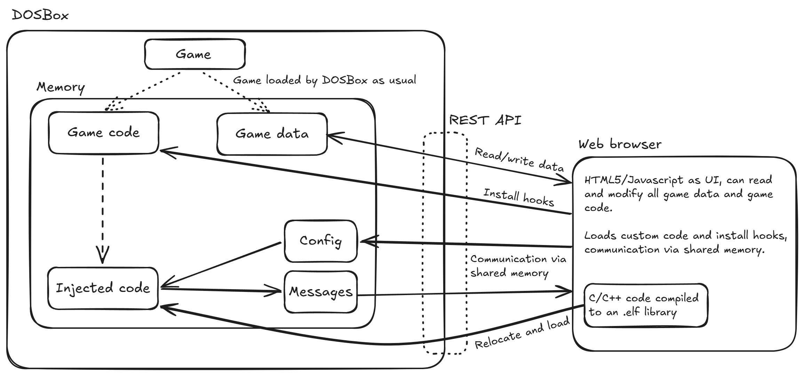

# DOSBox Hooks

A toolkit for hooking and modding old games running in DOSBox with an unholy mix of modern TypeScript, modern C, and 16-bit x86 assembly.

Currently requires a pre-release version of [DOSBox staging](https://www.dosbox-staging.org/releases/development-builds/).
If you are reading this after a 2026 release of DOSBox staging then the normal release version of it should just work!

**Caution:** This is a very hacky proof of concept.
Some parts of the code, especially on the Javascript side of things, are not cleaned up at all and are full of TODOs and FIXMEs.


## Overview



DOSBox Hooks consists of two parts: a [client](./client/) written as a web app running in a normal browser that accesses DOSBox memory via the REST API in DOSBox staging.
It injects the second component, the [server](./server/) (C/C++), into the emulated machine and communicates with it via shared memory.

The client can't call the server directly, it modifies the running game by installing hooks that make the game call the injected server code.
Once the game triggers your injected code you are free to do whatever you want within the context of the emulated machine.

## Demo

[test_hook_target](./test_hook_target/) is a simple DOS app that just calls some dummy functions in a loop.
[server/src/example_app_hooks.c](./server/example_app_hooks.c) defines hook functions that [client/example.html](./client/example.html) installs and configures.

1. Build the client: `npm install`, `npm run build` in `client/`
2. Copy the client to the `webserver` resource directory (it's next to your `dosbox-staging.conf`)
3. Build the server: `make` in `server/`
4. Copy `server/build/inject.elf` into the `webserver` resource directory
5. Open http://localhost:8080/example.html while DOSBox is running (must be done before starting the hook target)
6. Start `hook_me.exe 1 2 3 4` from [test_hook_target](./test_hook_target/hook_me.exe) in DOSBox
7. Click `Install hooks` on the web app, you should see log messages and hook_me.exe should print different numbers

## End-to-end overview: how the C code actually ends up running

**Caution: Some of this setup is very cursed and may be disturbing, reader discretion is advised.**
Really, I'm surprised that some of these things here work at all.


### Stupid requirements: 16-bit real mode code running from extended memory

I wanted to keep the CPU in 16-bit real mode just because prior to starting this project I had no idea whatsoever about how any of this old DOS stuff works.
Learning the intricacies of switching between real and protected mode seemed too daunting, real mode is just much simpler.
Or so I thought.
So that's the first stupid requirement here.

Usually 16-bit code can only access the first 1.06 MiB of memory.
That restriction comes from the addressing scheme: 16-bit offsets into a 16-bit segments where the highest possible segment starts at memory address 0xFFFF0, so you can only reach addresses up to 0x10FFEF.

XMS/EMS can load data into higher addresses and then load them into low memory areas on request, but it's tricky at best to run code from there.
But I didn't really want to use any of that precious lower memory, so the second stupid requirement was to run code from XMS memory.

Why is that a stupid requirement?
Low memory isn't actually that crowded on DOSBox as all the DOS code and drivers don't actually run on the emulated CPU.
Still, some games will just allocate all the memory they can get and I wanted to be able to load my code after the game starts.

There is a trick called [unreal mode](https://wiki.osdev.org/Unreal_Mode) to make offsets 32 bits wide by temporarily switching in protected mode and relying on the quirk that some internal caches are not reset if you exit it again.
On DOSBox you don't actually need to enable that, it doesn't bother checking these limits for all segments *except the stack*.
So we can just set all segments except the stack to 0 and just use normal flat addresses and it will just work in DOSBox.
As for the stack: we can just use the stack of the running game in the hook, right?


### Cursed C toolchain: compiling 16-bit code with modern compilers

gcc supports `-m 16` aka `.code16gcc` on x86 that generates 16-bit real mode instructions.
That feature really only exists to compile parts of the bootloader in Linux and is not really meant to be used anywhere else.
All it really does is put a bunch of address and data size overrides in front of instructions; it still doesn't know about all the messy real mode things like segments and far pointers.

This mostly works.
But it does not expect to run code from 32 bit addresses and that causes it to miscompile some control flow instructions.
For example, look at this instruction:

```
eb 05  jmp 0x05
```

It's a relative jump that jumps ahead by 5 bytes.
So where does it jump to if you are currently at address 0x1FFFF?
That's right, it jumps to 0x0004!
It's a 16-bit instruction, it doesn't care about your 32 bit instruction pointer.
I'm not actually sure how real hardware in unreal mode would behave here, but DOSBox always sets the upper 16-bit of EIP to zero on 16-bit jumps.
Real hardware might jump to 0x10004 instead.
The right version of that instruction would have been `66 eb 05`.

The corresponding CALL relative CALL instruction gets generated with the 0x66 prefix by gcc which is odd.
But indirect CALLs are even more cursed, gcc generated this abomination for calling a function pointer on the stack:

```
67 ff 5c 24 10  lcall [esp + 0x10]
```

This is very wrong.
Not only is it missing the 0x66 prefix to make the target address 32 bits large, it is also a *far call*.
A far call uses a far pointer consisting of a 16-bit segment and 16-bit address instead of the flat address we want to use.
gcc doesn't even support far pointers, so why would it ever generate an instruction trying to use one?
And this one can't even be blamed on it not meant to run from 32 bit addresses.

Adding the 0x66 prefix here would turn this into an even more cursed instruction that pushes 8 bytes onto the stack and loads a 6 byte long far pointer from memory and jumps there.
At least in DOSBox that seems to be emulated correctly, but I'm not sure such an instruction is ever used in real old code (but the non-indirect variants of this are very useful).


### Cursed C toolchain: regular expressions to the rescue!

Multiple AI models told me that the problem I was trying to solve was unsolvable with modern compilers and I should just accept that and do something reasonable like switching to protected mode or just running from low memory.
But no, does this setup seem like I'm interested in reasonable solutions?
We can just patch the generated code to add the missing prefixes with sed.

Patching the final binary would be a bit messy because inserting prefixes would shift around offsets and we would need to adjust these.
But here's a fun gcc feature: `gcc -S` makes it generate assembly code instead of binary code.
That assembly can just be patched up and passed to gcc again to generate a binary.
[Check out the Makefile](./server/Makefile) to see that mess in its full glory.

Fixing the missing 0x66 on `jmp/j<cc> immediate` instructions is straightforward, just add `data32` in front of all of them.

Fixing the indirect call instructions is a bit more messy, mainly because I'm running gcc with Intel assembly syntax.
The Intel assembly syntax is also probably the cause of this miscompilation in the first place.
In the first step it generates the call as `call [DWORD PTR imm[reg32]]` which the second step assembles as a far call which is probably not what that mnemonic is supposed to mean.
But I couldn't find any documentation for GAS (the assembler in gcc) in 16-bit real mode with Intel syntax.
I'm starting to think there might not be many users for that particular combination.

So how do you get that assembler to generate a normal call here?
After some trial and error I found that just `call [imm[reg32]]` does the right thing, it even adds the 0x66 prefix!
I should probably file a bug for gcc at some point once I can create a cleaner and more reasonable reproducer.
The current version of the code doesn't even generate this instruction.

Long story short: gcc is perfectly able to compile modern C code to 16-bit x86 assembly running in 32 bit address space!


### What about the segmented stack?

I said above that we can just leave the stack segment untouched and use the stack from the hooked application.
But it turns out that's not actually true.
The stack segment is implicitly added to all operations that use the stack or addresses based on the ESP and EBP registers, so at first glance the actual value of it seems irrelevant if we just use the stack from the hook context.

But this falls apart as soon as we try to use an address derived from the stack in a different context.
For example, if we take a pointer to something stored on the stack and pass it to some other function that just expects a normal pointer, it will fail as soon as it uses a non-stack register to access it.

The only fix (in real mode) is to set the SS, DS, and CS registers to the same value.
If we set them all to 0 that means the stack must reside in the first 64 KiB of memory.
That's a bit messy because the application's stack is unlikely to be in that memory area and we won't be able to find free space there once a game is started.

The other solution is to set the other registers to the stack register and adjust the addresses accordingly.
However, this requires us to know the value of the stack segment prior to loading the code and if it ever changes (to be fair, that is unlikely) all pointers would be invalidated and we would need to reload the code.
This would probably work as the stack segment shouldn't change and we should be able to determine it once the game is running.

But for now, I'm just requiring to allocate the stack before starting the game to get some space in segment 0.
A much more reasonable solution than all of that would be to just use unreal mode, but with DOSBox default settings that changes CPU speed which I don't like (and some games might not like it as well).


### Loading code in DOSBox

This is surprisingly simple, the DOSBox API has an endpoint to allocate memory from either the DOS allocator or the XMS allocator.
The exact addresses where we get memory in can of course vary between runs, so the code needs to be able to handle that.
Luckily that is a common requirement and `-fPIC` or `-fPIE` solves almost all of our problems by generating code that uses addresses relative to the code itself.
If we then just tell the linker to put data and code right next to each other and generate a flat binary file we can just load this and it will just work regardless of the exact address.

But I still wanted to load code and data into different memory spaces just to make the overall setup a bit cleaner, I didn't like that offsets shifted around as the code size was changing.
So I'm instead generating an .elf file with relocation information and implemented a simple loader in Javascript that uses the relocation information to patch up the code for any target address.
This was also surprisingly straightforward.

Using an elf file also makes it very easy for Javascript code to get offsets of symbols, for example, this is used to inject data on load such as a pointer to shared data structures and scratch memory space.
Hooks also expose configuration as structs and the elf file tells the client the offsets.
Of course, a .map file would achieve the same, but elf is probably easier to parse.


### Hooking functions

Our custom code is now compiled and loaded, how do we call it?
The DOSBox API does not give us direct control over what the CPU is executing.
(But maybe that is a cool idea for a feature? Some kind of fake interrupt that is triggered via the API to jump to arbitrary code?)

So instead, we have to modify the code of the game to call us.
This is done via an unholy amalgamation of Javascript/Typescript and 16-bit x86 assembly.
I don't know how often these two languages are mixed in the same file.

The actual hook consists of 4 steps:

1. The hook: the first 5 bytes of the hooked function is overwritten with `ljmp <segment>:<offset>` to a trampoline function
2. The trampoline: a small piece of code generated specifically for the hooked function that calls out to C and returns to the hooked function afterwards
3. The C entry point: switches stacks, flattens address space, decodes parameters from the trampoline, calls hook handler
4. Your code: a C function that gets a pointer to the original arguments and/or return value

Steps (1) and (2) are split because (1) has to override game code and hence has to be as short as possible, 5 bytes is the shortest that is reasonably possible (well, you could find some unused space within the function and do a 2 byte relative jump there first... but no, not yet).

The trampoline function (2) is specific to a hooked function and prepares passing call arguments on to the C code in a standard format regardless of the original function's calling convention.
That standard is just 16-bit cdecl, so for that case it just pushes a pointer to the stack frame onto the stack.
For register-based calling conventions it also needs to put those registers onto the stack and restore them afterwards to allow the hook to change arguments.
Finally it returns control flow to the original code, since we know the location we hooked that is just another ljmp.

A particular nasty case is hooks that should run after a function returns and possibly change the return value.
We have to replace the return address with our hook (can't inject an extra entry onto the stack without messing with arguments).
But then, how do we return to the original from there?
Unlike in the case above, the return address is not the place we hooked, and it will change between invocations.
Currently, this is done with some nasty piece of self-modifying code that adjusts the end of the trampoline dynamically.
It doesn't work for recursive functions, so this should really be replaced with a separate stack that stores these return trampolines.

Finally step (2) also needs to execute the instructions that we overrode to inject step (1).
It's not as simple as just copying 5 bytes due to variable instruction length.
So the Javascript code disassembles the beginning of the hooked function to exactly figure out how many bytes need to be moved.

All of the necessary code is generated dynamically on the fly by glueing together assembly code as strings and assembling it with Keystone.js, an assembler compiled to WASM.
So that's how you end up with a wild mix of Javascript and x86 assembly in the same file.


## TODO list/what doesn't work

* Code is in serious need of a cleanup
* 32 bit/protected mode support
* Hooks can't call functions that are themselves hooked as stack switching in [entry.c](./server/src/entry.c) isn't reentrant
* Recursive functions can't use post-run hooks as the return trampoline uses non-reentrant self-modifying code
* Functions that access the CS register in the first 5 bytes can't be hooked
* Register-based calling conventions don't support post-run hooks
* Post-run hooks don't see the original arguments directly in the hook
* No helper functions for calling back to the game or to DOS functions, but you do get a low memory buffer area to use
* No clang support
* The C toolchain is very cursed, most of this could be fixed with switching to protected mode
